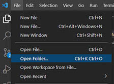
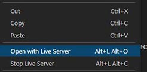

# 1. HTML 
## définition
HTML est l'acronyme de `HyperText Markup Langage`.   
HTML est un langage de balisage dont le rôle est de structurer le contenu de pages web.   
On parle de __HTML5 sémantique__ car ses balises ont un rôle plus précis qu'avant dans la gestion du contenu d'un site web.

## Documentation en ligne

https://developer.mozilla.org/fr/docs/Web/HTML/Element


# 2. Structure d'un document HTML

## Visual Studio Code

Toujours faire `ouvrir un dossier` ou `nouveau dossier` afin d'avoir l'onglet gauche des dossiers et fichiers.  



Ensuite, créer un Fichier avec un nom sans accent ni espace : __first-page.html__    
Si emmet est installé, le code ci-dessous peut être produit en tapant __!__ puis touche __tab__ ou __entrée__.
```html
<!DOCTYPE html>
<html lang="en">
    <head>
        <meta charset="UTF-8">
        <meta name="viewport" content="width=device-width, initial-scale=1.0">
        <meta http-equiv="X-UA-Compatible" content="ie=edge">
        <title>Document</title>
    </head>
    <body>
        <!-- contenu de la page -->
    </body>
</html>
```
## Dans `<head>`
La balise head ne s'affiche pas dans le document.  
Elle contient tout ce dont à besoin la page pour s'afficher et fonctionner correctement.    _styles, scripts, polices de caractères, et autres metadonnées_. 
## Dans `<body>`
C'est là qu'on intègre le contenu de la page dans des balises qui représenteront le mieux chaque élément de la page.  
* Un titre de page : `<h1>Carnet de route</h1>`
* Un article de blog :  `<article> <!-- contenu --> </article>`  


# 3. Les balises de contenu textuel et image
 

## Titres `<h1>-<h6> `
```html
    <!-- body = contenu de page -->
    <body>
        <h1>Carnet de route</h1>
    </body>
```
Puis `Faire un clic droit dans la page`  




## Paragraphes `<p>`
```html
    <body>
        <p>Un article sur le thème de l'écologie</p>
    </body>
```
## Balise `<span>`
Très utile pour mettre en évidence un ou plusieurs mots dans un bloc de texte paragraphe par exemple.
```html
    <body>
        <!-- Le span prend toute son importance avec le style css. --> 
        <p>Un article sur le thème de <span>l'écologie</span> et de la biodiversité</p>
    </body>
```

## Listes `<ul> ou <ol>`
```html
    <body>
        <h1>List of 5 Cars</h1>
        <ul>
            <li>Toyota Camry</li>
            <li>Honda Civic</li>
            <li>Ford Mustang</li>
            <li>Chevrolet Silverado</li>
            <li>Nissan Altima</li>
        </ul>
```
# 4. balises de séparation
## Saut de ligne `<br>` 
C'est une balise isolée qui permet un saut de ligne.    
```html
    <body>
        <!--  passe à la ligne le texte : "et de la biodiversité"  -->
        <p>Un article sur le thème de <span>l'écologie <br> et de la biodiversité</p>
    </body>
```   
## Trait horizontal `<hr>` 
documentation [hr](https://developer.mozilla.org/fr/docs/Web/HTML/Element/hr) 

## Images ``
### Adresse absolue
```html
    <body>
        <!--  On donne l'url complète du document  -->
        
    </body>
```
### adresse relative
```html
    <body>
        <!-- Ici une image placée dans le même que le document appelant -->  
            
        <!-- Ici une image contenue dans un sous-dossier nommé _images_  -->    
          
        <!-- Là une image contenue dans un dossier nommé _images_ en amont du fichier appelant -->    
         
    </body>
``` 


# 5. Liens vers des fichiers externes
 
## Lien hypertexte `<a>` 
```html
    <body>
        <!-- adresse absolue -->
        <a href="https://example.com/contact.html">contact</a>
        <!-- adresse relative -->
        <a href="./contact.html">contact</a> 
    </body>
``` 

# 6. Les balises structurantes
Elles permettent de regrouper plusieurs contenus dans des balises sémantiques.
ces balises prennent toute leur importance avec css dans la construction de modèles de pages web. 
## `<div>`
C'est le plus ancien conteneur. Il n'est pas sémantique.  

```html
    <body>
        <div>
            <h2>Titre d'un article</h2>
            <p>Le texte de l'article</p>
        </div>
    </body>
``` 
## `<article>`
Par exemple pour un blog.
```html
    <body>
        <article>
            <h2>Titre d'un article</h2>
            <p>Le texte de l'article</p>
        </article>
    </body>
``` 
## `<figure>`
```html
    <body>
        <figure>
             
            <figcaption>Le lion blanc</figcaption>
        </figure>
    </body>
``` 
##
Il n'y a pas d'obligation à utiliser telle ou telle balise. C'est juste du bon sens et faciliter la lecture par les robots référenceurs.
##
## Structurer un document
- Documentation [structurer un document](https://developer.mozilla.org/fr/docs/Learn/HTML/Introduction_to_HTML/Document_and_website_structure).  
- Documentation [les éléments sémantiques](https://fr.w3docs.com/apprendre-html/les-elements-semantiques-html5.html)

