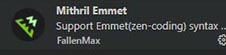
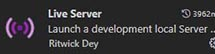
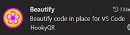

# 1. les logiciels utilisés
## Editeur de code en ligne.
- Codepen : https://codepen.io/ _(ouvrir un compte gratuit)_.  
- Très pratique pour prototyper et partager ses expérimentations.  
- J'ai utilisé ```codepen``` pour créer rapidement des prototypes que je peux partager aisément avec vous. 
## Editeurs de code I.D.E. (integrated development environment).  
Installer Visual Studio Code : https://code.visualstudio.com/  
L'éditeur est plus adapté quand il est question d'intégrer des composants de page web plus concrets.
## Extension Emmet 
Installer __Emmet__ dans un IDE permet de coder plus vite et sans erreur.  


  

La doc Emmet : https://docs.emmet.io/    
Il est aussi présent dans Codepen et facile à installer.  
## Extension Live server
Il permet d'exécuter une page dans un serveur local.   




## Extension beautify
Il permet d'indenter le code afin de rendre plus lisible la hiérarchie des balises 




## Documentation Mozilla
Mozilla propose un site de référence à la fois glossaire et tutoriel.      
 https://developer.mozilla.org/fr/

## Youtube
Des tutos pour tout !  _Mais attention à filtrer pas date._

## L'inspecteur du navigateur
Tous les navigateurs ont ce programme.   
Il suffit de faire `clic droit dans la page` et de le sélectionner.   
C'est un outil incontournable pour HTML, CSS et JavsScript .

# 2 Comment apprendre et progresser

## Les chapitres de ce support
J'ai essayé de regrouper dans ces chapitres les bases fondamentales pour bien démarrer.    
L'ordre des chapitres a son importance, et globalement on doit comprendre les points suivants :
1. Travailler autour d'un elément donné. Exp : un texte, un titre , ...
2. Comment regrouper plusieurs éléments dans un système de boîtes.  
3. Comment positionner ou superposer des boîtes.
4. Comment aligner des boîtes. _(nous nous rapprochons ici de la création de gabarits de de page web)_.

## Exercices d'application
Après une présentation de HTML et CSS et de ce support de cours, il sera plus intérressant et attractif de travailler autour de petits exemples de composants de page web.  
IL est primordial de raccorder les techniques utilisées dans les exercices avec le support et autres ressources en ligne.